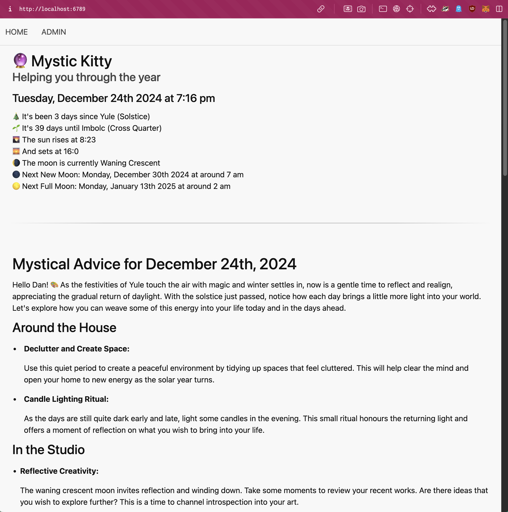
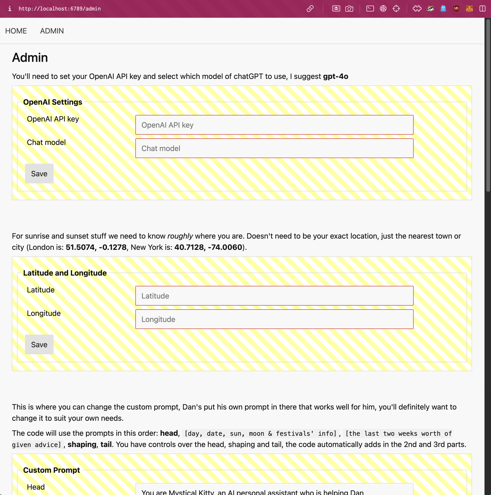

# mystic-kitty

Mystic Kitty is an AI system (OpenAI API) designed to give advice and guidence on the journey through the seasons and "wheel of the year". Kitty is basically acting as a modern digital witch 🧙‍♀️🐾

It runs as a local webservice with the idea that you spin a local server up and then visit the created webpage. Each day the AI will generate advice and guidence based on the sun, moon, upcoming & recent festivals (Yule, Imbolc, Mabon etc) and so on.

An admin page allows you to tune the prompts used so you can customise it to your own (mystical) needs.

### Main Page

### Admin Page

# NOTES

I designed this for personal use and the prompts (and other stuff) were hardcoded. Normally I'd just run this as a purely terminal tool, but to make it a little more 'public facing', and as an interesting exercise, I turned it into a simple web service instead. I figured other people may find it interesting.

There are several improvements you could make to this, specifically NOT making the main page wait for the backend to get a reply back from the OpenAI API. But, I also don't want to spend a huge amount of time on that and it works just fine for what I need.

You should **not** run this on a public server as you'll expose your API key, or if you _do_ have it password protected. Some simple refactoring would turn it into something that could hang off a public server, update daily and remove the admin pages.

Any text you enter will be submitted to the OpenAI API endpoint.

I ask the API for markdown formatted text back, but how it decides to format that is pretty random so consistence will be variable. Again possibly an easy fix but 🤷‍♂️

# SECRET SAUCE

There are TWO things that I believe make this slightly different form just typing the prompt into ChatGPT.

First, it automatically adds information about sunrise, sunset, moon phase and festivals into the prompt.

Second, and this is probably more important, it rolls the last two weeks worth of previous advice back into the prompt. This is to keep a "rolling context window" going with the advice.

Otherwise it would just be like taking a quick narrow daily "stab" at information, which has no view into if it's already told you that information or not, which leads to repeated information (or at least less small repeated information).

The default prompt has also been written for "foreshadow" upcoming stuff. By rolling in recent advice the system can look back at what foreshadowing it has done for the whatever day you may be at.

# TODO

If I were going to add something the next thing would be an Archives page, that allows you to view older pages.

Instead the advice is stored in the `/advice` folder, you'll figure it out. 

# REQUIREMENTS

* A pretty recent version of nodejs, I'm using v22.12.0
* npm
* nvm if you're feeling fancy
* An OpenAI API key
* Your rough latitude and longitude
* Some good will

# INSTALLATION

Clone the repo

In your terminal window change into the folder and run...

`npm install`

Then create a `.env` file (or rename `.env.txt` to `.env`), and make sure it has `PORT=nnnn` where `nnnn` is the port number you want it to run on, I use `6789`

Next; `npm start` to spin up the webserver.

Visit http://localhost:6789 (or whatever you set the PORT number to be), and you'll be presented with an admin page to add your OpenAI API key, select which model of chatGPT to use (I'm using 'gpt-4o') and hit save. The page will bring you back to enter your rough latitude and longitude and then fianlly modify the prompt that'll be used so you can change it to suit you better.